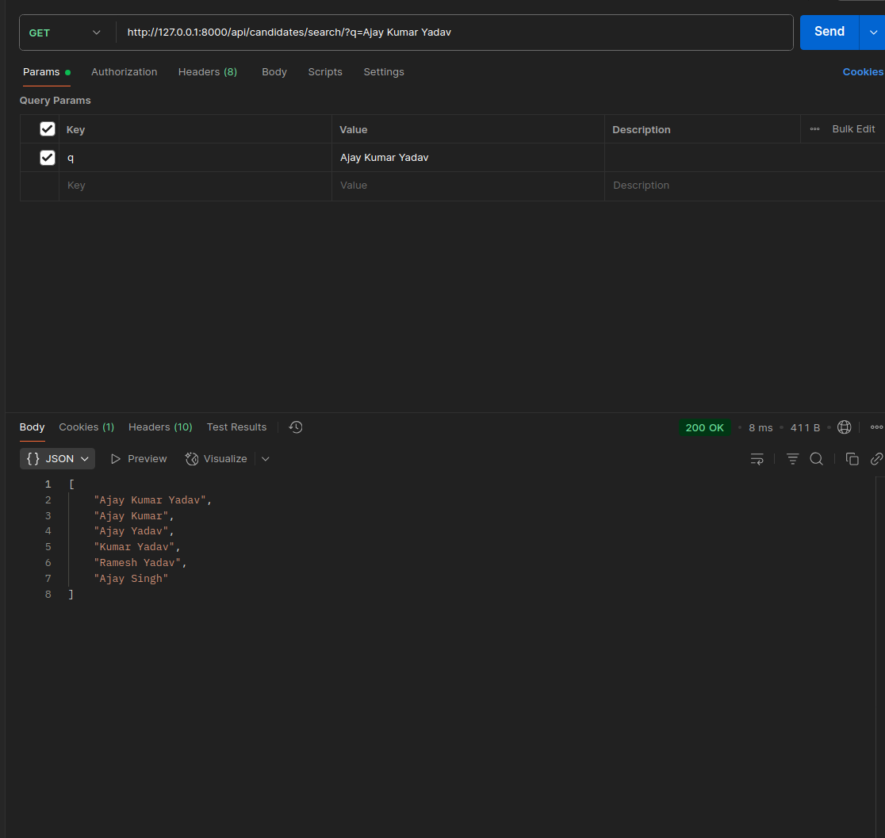
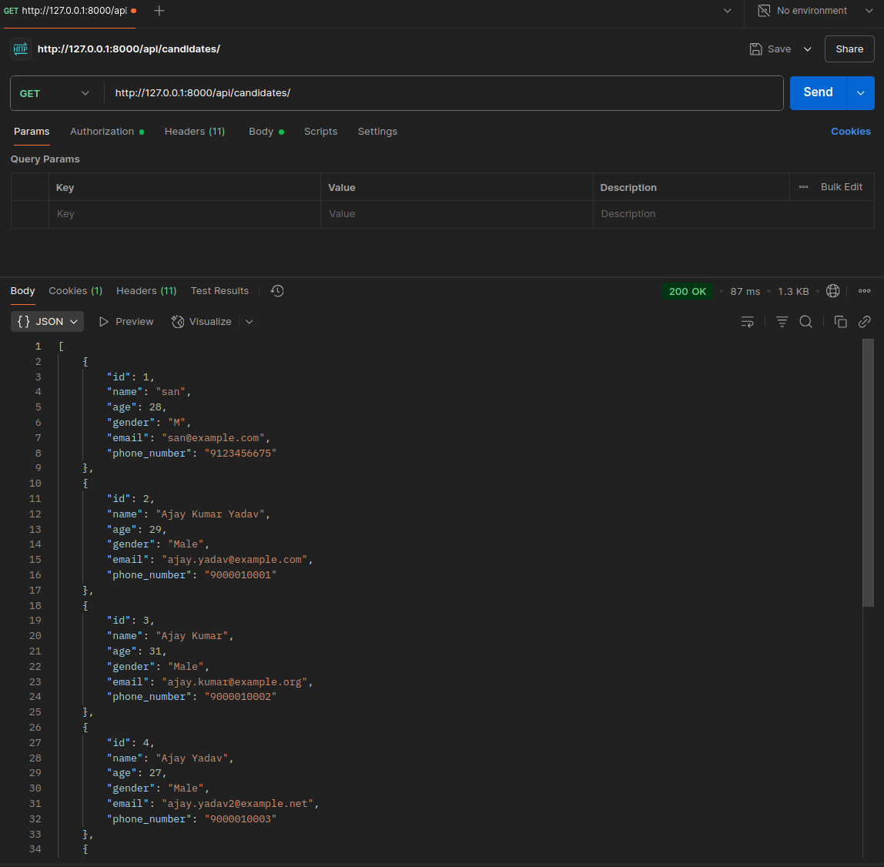
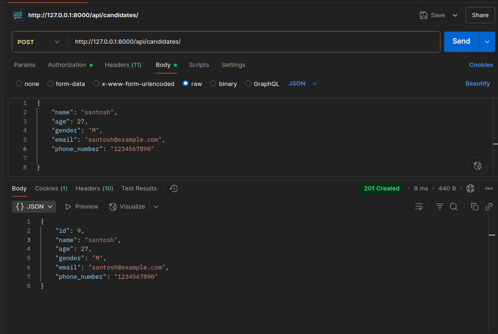
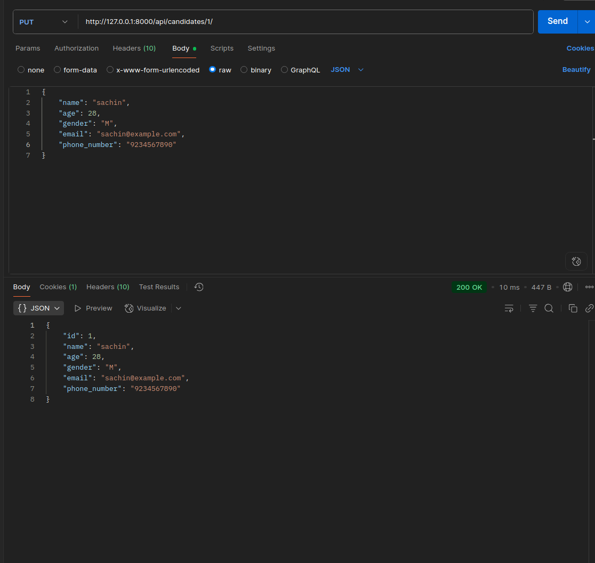
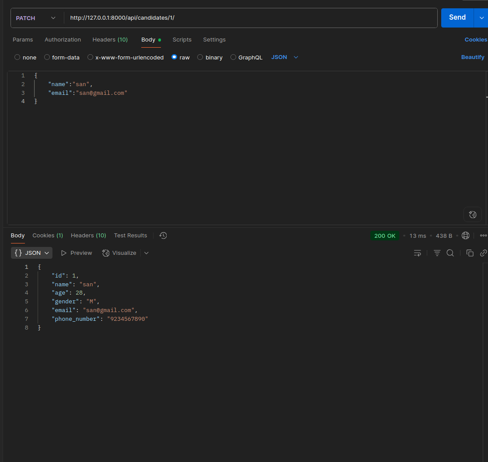
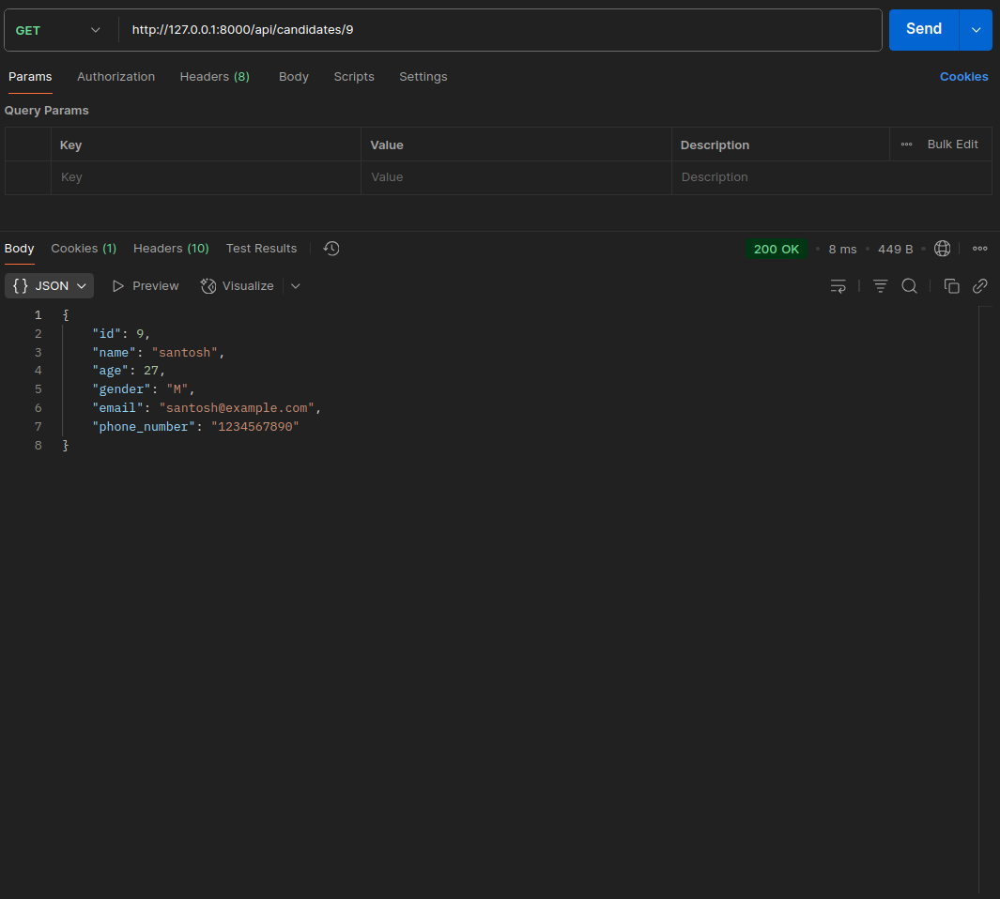
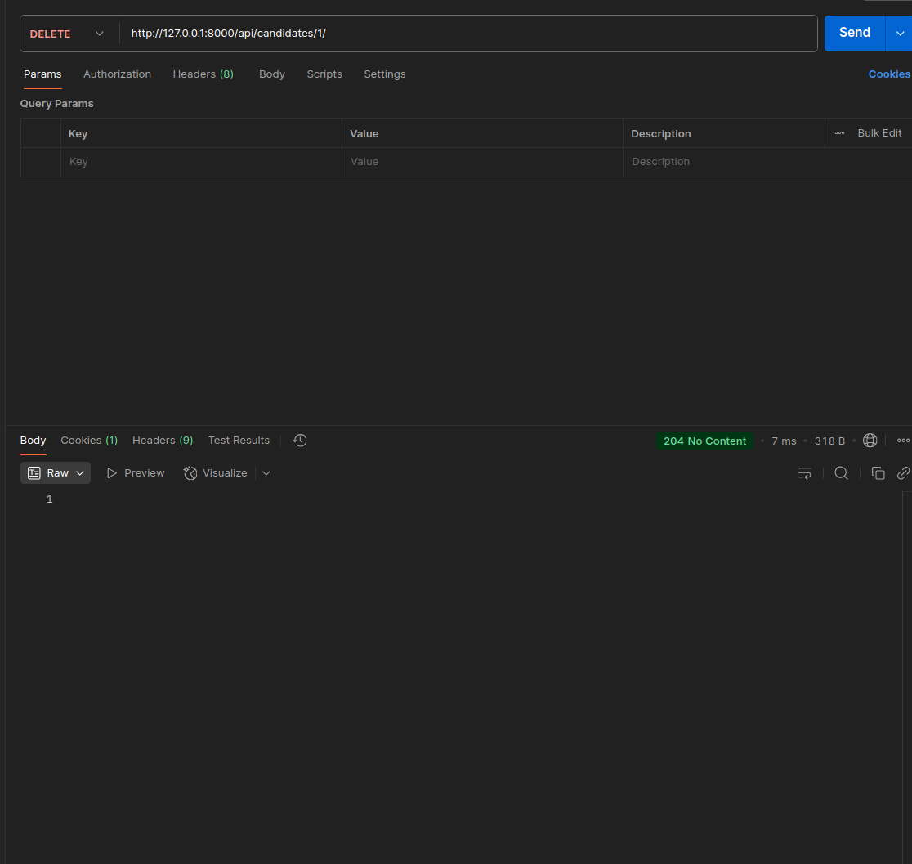

# Django ATS System

## Project Structure
```bash
ats/
├── ats
│   ├── asgi.py
│   ├── __init__.py
│   ├── settings.py
│   ├── urls.py
│   └── wsgi.py
├── candidates
│   ├── admin.py
│   ├── apps.py
│   ├── __init__.py
│   ├── migrations
│   ├── models.py         # Candidate model
│   ├── seed_data.py      # Script to bulk-insert sample data
│   ├── serializsers.py   # CandidateSerializer
│   ├── tests.py
│   ├── urls.py           # Router for CandidateViewSet
│   └── views.py          # CandidateViewSet (CRUD + search)
├── db.sqlite3
├── manage.py
└── requirements.txt      # Python dependencies
```

## Overview
This repository contains a Django REST Framework ATS system:
- A **`Candidate`** model with fields: (name,age, gender, email and phone_number)
- Standard CRUD endpoints (via **`CandidateViewSet`**)
- **`GET /api/candidates/`**  : list all candidates

- **`POST /api/candidates/`**  : create a new candidate

- **`GET /api/candidates/{id}`**  : retrive a single candidate by using ID

- **`PUT /api/candidates/{id}`**  : update all fields of a candidate

- **`PATCH /api/candidates/{id}`**  : partially update a candidate

- **`DELETE /api/candidates/{id}`**  : delete a candidate

- **`GET /api/candidates/search/?q=<query>`**  : Return candidate names matching `<query>`, sorted by how many query words appear in their name (relevance score).


## Installation & Setup

**1. Clone the repository**
```bash
 git clone https://github.com/santoshgawande/ats-api.git
   cd ats
```

**2. Create and activate a virtual environment**
```bash
python3 -m venv .venv
source .venv/bin/activate
```
**3. Install dependencies**
```bash
pip install -r requirements.txt
```
## Database Migrations

```bash
python manage.py makemigrations
python manage.py migrate
```
## Import Data for Testing

To quickly populate the database with sample candidate records, run:
```bash
python manage.py shell < candidates/seed_data.py
```

## Running the Development Server
```bash
python manage.py runserver
```
- By default, the server listens on http://127.0.0.1:8000/


## API Testing Examples (Postman)

### **1. Search Candidates**



### **2. List All Candidates**



### **3. Create a New Candidate**


### **4. Update an Existing Candidate**



### **5. Partially Update a Candidate**



### **6. Retrieve Candidate by ID**



### **7. Delete a Candidate**

